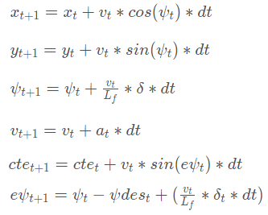

# CarND-Controls-MPC
Self-Driving Car Engineer Nanodegree Program

This is the Final project of the SDC term2 program. The **MPC** stands for **Model Predictive Control**, which minimizes the cost between the reference trajectory (the given path approximated by a 3rd polynomial) and the predictive trajectory (calculated with the use of motion model).
By carefully transforming this problem to a constraint optimization problem, MPC do a good job in a simulator provided by Udacity!

---

## Dependencies

* cmake >= 3.5
 * All OSes: [click here for installation instructions](https://cmake.org/install/)
* make >= 4.1
  * Linux: make is installed by default on most Linux distros
  * Mac: [install Xcode command line tools to get make](https://developer.apple.com/xcode/features/)
  * Windows: [Click here for installation instructions](http://gnuwin32.sourceforge.net/packages/make.htm)
* gcc/g++ >= 5.4
  * Linux: gcc / g++ is installed by default on most Linux distros
  * Mac: same deal as make - [install Xcode command line tools]((https://developer.apple.com/xcode/features/)
  * Windows: recommend using [MinGW](http://www.mingw.org/)
* [uWebSockets](https://github.com/uWebSockets/uWebSockets)
  * Run either `install-mac.sh` or `install-ubuntu.sh`.
  * If you install from source, checkout to commit `e94b6e1`, i.e.
    ```
    git clone https://github.com/uWebSockets/uWebSockets 
    cd uWebSockets
    git checkout e94b6e1
    ```
    Some function signatures have changed in v0.14.x. See [this PR](https://github.com/udacity/CarND-MPC-Project/pull/3) for more details.
* Fortran Compiler
  * Mac: `brew install gcc` (might not be required)
  * Linux: `sudo apt-get install gfortran`. Additionall you have also have to install gcc and g++, `sudo apt-get install gcc g++`. Look in [this Dockerfile](https://github.com/udacity/CarND-MPC-Quizzes/blob/master/Dockerfile) for more info.
* [Ipopt](https://projects.coin-or.org/Ipopt)
  * Mac: `brew install ipopt`
  * Linux
    * You will need a version of Ipopt 3.12.1 or higher. The version available through `apt-get` is 3.11.x. If you can get that version to work great but if not there's a script `install_ipopt.sh` that will install Ipopt. You just need to download the source from the Ipopt [releases page](https://www.coin-or.org/download/source/Ipopt/) or the [Github releases](https://github.com/coin-or/Ipopt/releases) page.
    * Then call `install_ipopt.sh` with the source directory as the first argument, ex: `bash install_ipopt.sh Ipopt-3.12.1`. 
  * Windows: TODO. If you can use the Linux subsystem and follow the Linux instructions.
* [CppAD](https://www.coin-or.org/CppAD/)
  * Mac: `brew install cppad`
  * Linux `sudo apt-get install cppad` or equivalent.
  * Windows: TODO. If you can use the Linux subsystem and follow the Linux instructions.
* [Eigen](http://eigen.tuxfamily.org/index.php?title=Main_Page). This is already part of the repo so you shouldn't have to worry about it.
* Simulator. You can download these from the [releases tab](https://github.com/udacity/self-driving-car-sim/releases).
* Not a dependency but read the [DATA.md](./DATA.md) for a description of the data sent back from the simulator.


## Basic Build Instructions


1. Clone this repo.
2. Make a build directory: `mkdir build && cd build`
3. Compile: `cmake .. && make`
4. Run it: `./mpc`.

## [Rubric](https://review.udacity.com/#!/rubrics/896/view)

1. The Model
>Student describes their model in detail. This includes the state, actuators and update equations.

The state is defined the same as the course's lecture, which is [x,y,psi,v,delta,acceleration], where delta and acceleration are actuators.
Update equations are (global kinematic model):



2. Timestep Length and Elapsed Duration (N & dt)
>Student discusses the reasoning behind the chosen N (timestep length) and dt (elapsed duration between timesteps) values. Additionally the student details the previous values tried.

I choose `N=15` and `dt=0.1`. Because my target speed is 70mph, a big number of N will have a very long predictive trajectory which may not be realistic. Moreover, big `N` means more computations in solving optimization problem. The solver may return a bad solution due to the time constraints. (`"Numeric max_cpu_time          0.5\n";`)
Finally, `dt=0.1` because of the latency in the system. Also, I found that `N*dt` is 1.5 seconds which is good enough for my 70mph setting.

3. Polynomial Fitting and MPC Preprocessing
>A polynomial is fitted to waypoints. If the student preprocesses waypoints, the vehicle state, and/or actuators prior to the MPC procedure it is described.

I used 3rd order of polynomial to fit the waypoints. Moreover, the waypoints is first converted from the map-coordinates to vechicle's coordinates. Vechicle's position will be considered as origin and the x-axis is exactly the heading direction (psi=0).
```c++
// convert to car's coordinates! (px, py, and psi will be considered as 0)
for (int i=0;i<ptsx.size();i++)
{
    double shift_x = ptsx[i]-px;
    double shift_y = ptsy[i]-py;
    ptsx[i] = (shift_x *cos(0-psi)-shift_y*sin(0-psi));
    ptsy[i] = (shift_x *sin(0-psi)+shift_y*cos(0-psi));
}
```
An important reason to do so is because it makes it easy to find the polynomail fitting. If we use the map's coordinate system, it is hard to fit a polynomial to a **verticle** trajectory!

4. Model Predictive Control with Latency
>The student implements Model Predictive Control that handles a 100 millisecond latency. Student provides details on how they deal with latency.

Before the coordinate transformation, I first use the kinematic model to predict the new state at latency time.
```c++
// predict state in 100ms of latency
double latency = 0.1;
px = px + v*cos(psi)*latency;
py = py + v*sin(psi)*latency;
psi = psi - v*delta/Lf*latency; // negative sign: simulator and car's coordinate see psi in opposite way.
v = v + acceleration*latency;
```
Then the waypoints are transformed to the vehecle's coordinate system according to the new positions. After that, we do `polyfit` and `mpc.Solve`. The `cte` and `epsi` are calculated as follows:
```c++
double cte = polyeval(coeffs,0);
double epsi = -atan(coeffs[1]);
...
state << 0, 0, 0, v, cte, epsi;
```
Note that these equations consider `px=py=psi=0` because of the coordinate transformation.
Latency is very important in successfully run a lap in simulator! In high speed, e.g. 70mph, without taking into acount of latency, vehicle will go off track!
